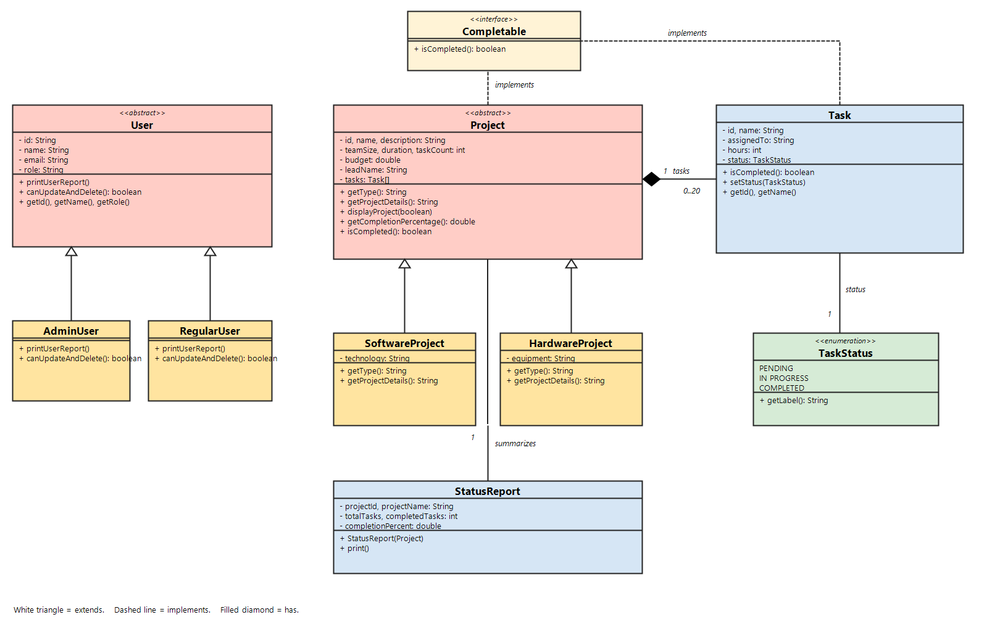

# Java Project Management System

This is a console program for software and hardware projects and their tasks. All data sits in arrays in memory. There is no database and no extra libraries. When you exit, the data is gone.

## Setup and how to run

You need:

- JDK 21
- IntelliJ IDEA Community Edition

### Run it in IntelliJ

1. Install JDK 21.
2. In IntelliJ, choose File → Open and open this folder.
3. If IntelliJ asks for a Project SDK, pick JDK 21.
4. Open `src/Main.java`.
5. Click the green Run button next to `main`.

The screen uses UTF-8, so the box borders and the check marks show correctly in IntelliJ.

### Run it from PowerShell

Open a terminal in this folder, then run:

```text
javac --release 21 -encoding UTF-8 -d out (Get-ChildItem -Recurse src -Filter *.java).FullName
java -cp out Main
```

## Who is logged in

The program starts as **eric mugisha (Admin)**. He can update tasks, remove tasks, and create users.

**shima elyse** is a regular user. She can look at projects and add projects and tasks. She cannot update or delete.

Use main menu option 4 to switch user. The last choice on that screen is `<<Back`.

## Main menu

```text
1. Manage Projects
2. Manage Tasks
3. View Status Reports
4. Switch User
5. Exit
```

`<<Back` is the last number on each inner screen. It returns you one step, not all the way to the start.

| Menu | What it does |
| --- | --- |
| 1. Manage Projects | Add a project, or open the catalog |
| 2. Manage Tasks | Add a task, view tasks, change a status, or remove a task |
| 3. View Status Reports | A table of every project and the average completion |
| 4. Switch User | Pick another user, or create one (admin only) |
| 5. Exit | Leave the program |

A bad menu number prints `Invalid option.` A letter where a number is needed prints `Please enter a number.` and asks again. The program does not crash.

Project ids look like `PRJ001`. Task ids look like `TSK001`. User ids look like `USR001`. You can type the full id or just the number (`1` means `PRJ001` or `TSK001`). On an id prompt, `0` goes back one step.

Five sample projects are already loaded, so the next project you add is `PRJ006`. The first sample task is `TSK001`.

| ID | Name | Type | Tasks | Completion |
| --- | --- | --- | --- | --- |
| PRJ001 | Alpha Tracker | Software | 3 | 33.33% |
| PRJ002 | IoT Sensor Kit | Hardware | 2 | 50.00% |
| PRJ003 | Mobile Checkout | Software | 2 | 100.00% |
| PRJ004 | Warehouse Robot | Hardware | 1 | 0.00% |
| PRJ005 | Payroll Portal | Software | 0 | 0.00% |

## Features mapped to user stories

| Story | What you do | What you should see |
| --- | --- | --- |
| US-1.1 Browse projects | Manage Projects → Browse Project Catalog → View All Projects | Id, name, type, team size, budget, and description. Software and hardware can also be listed on their own |
| US-1.2 Search by budget | Catalog → Search by Budget Range | Only projects inside the min and max. If none match, the screen says `No projects found.` |
| US-2.1 Add a software or hardware project | Manage Projects → Add Project | Choose Software or Hardware, then name, description, duration, budget, and team size. The new id is the next `PRJ` number |
| US-2.2 Add a task | Manage Tasks → Add Task, or Add New Task on a project | Task name, project id, status, and hours. The new id looks like `TSK001` |
| US-2.3 Update a task | Manage Tasks → Update Task Status, or option 2 on the project screen | Change Pending, In Progress, or Completed. Only an admin can do this |
| US-2.4 Remove a task | Manage Tasks → Remove Task, or option 3 on the project screen | The task leaves that project's array. Only an admin can do this |
| US-3.1 Users | Main screen, and option 4 Switch User | `AdminUser` and `RegularUser` are shown with different permissions |
| US-4.1 Completion | View Status Reports, or open one project | Completed tasks divided by total tasks, with two decimal places. No tasks means `0.00%` |
| US-5.1 Menu | Stay in the main menu | Options 1 to 5 repeat until Exit. A bad choice is asked for again |

The completion formula is:

```text
percent = completed tasks / total tasks * 100
```

Only a task whose status is Completed counts. Pending and In Progress do not. The report then averages those project percents.

## Class diagram

The diagram shows inheritance and the links between classes.



How to read it:

- A white triangle means **extends**. `SoftwareProject` and `HardwareProject` extend `Project`. `AdminUser` and `RegularUser` extend `User`.
- A dashed line means **implements**. `Project` and `Task` both implement `Completable`.
- A filled diamond means **has**. One project has from 0 to 20 tasks. Each task has one status. One status report summarizes one project.

A longer note is in [docs/design-decisions.md](docs/designDecisions.md).

## OOP design choices

`Project` is abstract. Shared fields live there: id, name, description, team size, duration, budget, lead, and the task array. You cannot write `new Project(...)`. A project must be a `SoftwareProject` or a `HardwareProject`.

Each subclass overrides two methods:

- `getType()` returns `Software` or `Hardware`
- `getProjectDetails()` returns `Technology` or `Equipment`

The catalog stores both kinds in one `Project[]`. When it prints a project, Java runs the subclass method. That is polymorphism. The menu never checks the class with `instanceof`.

`User` is abstract for the same reason. `AdminUser` and `RegularUser` override `printUserReport()` and `canUpdateAndDelete()`. Update, remove, and create-user ask `canUpdateAndDelete()` first. An admin returns true. A regular user returns false.

`Task` implements `Completable`. The completion count calls `isCompleted()` instead of comparing a status word in the menu. `Project` implements the same interface. A project is complete only when it has tasks and every task is completed. Status values are only `Pending`, `In Progress`, and `Completed`.

Fields are private. Most of them are set once in the constructor. Task status can change, but only to a `TaskStatus`. The project array stays inside `ProjectService`. The task array stays inside `Project`.

Projects, tasks, and users are stored in arrays, with a count of how many slots are used. Finding an id walks the array from the start. That is a linear search, O(n). The catalog sorts a copy by name with bubble sort, O(n²). The stored array keeps the order projects were added, so ids stay `PRJ001`, `PRJ002`, and so on.

There is no password, no saving to disk, and no `ArrayList`.

## Project layout

```text
src/
  Main.java
  models/       Project, SoftwareProject, HardwareProject, Task, TaskStatus, User, RegularUser, AdminUser, StatusReport
  interfaces/   Completable
  services/     ProjectService, TaskService, ReportService
  utils/        ConsoleMenu, ValidationUtils
docs/
  class-diagram.png
  design-decisions.md
```

`Main` only starts the menu. `ConsoleMenu` prints the screens. `ValidationUtils` checks numbers, empty text, email, and ids.
